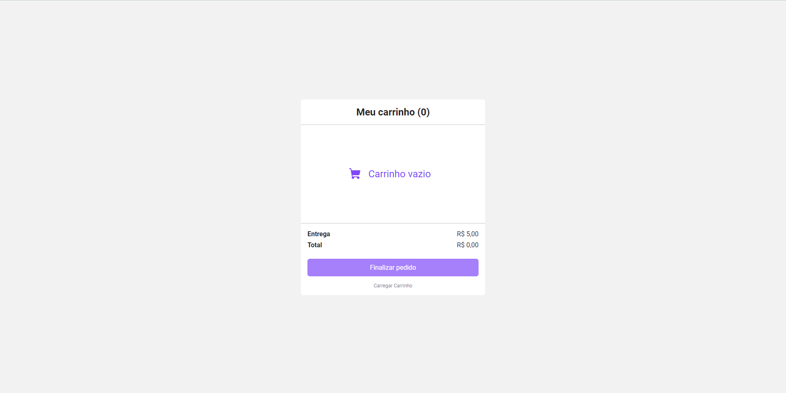
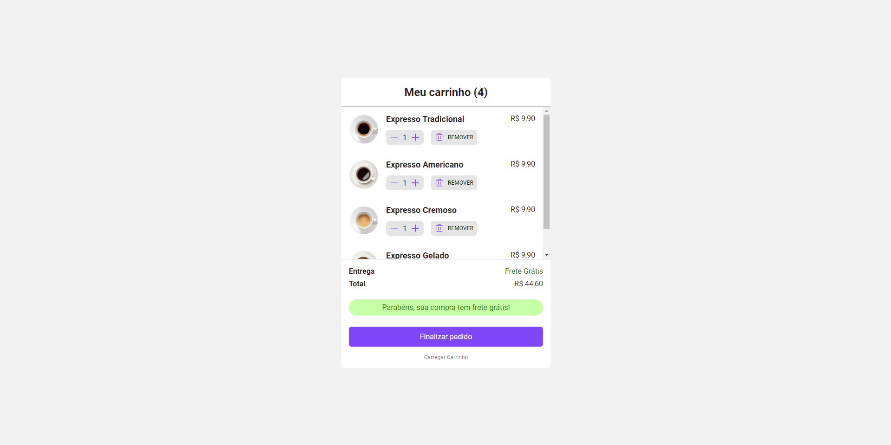
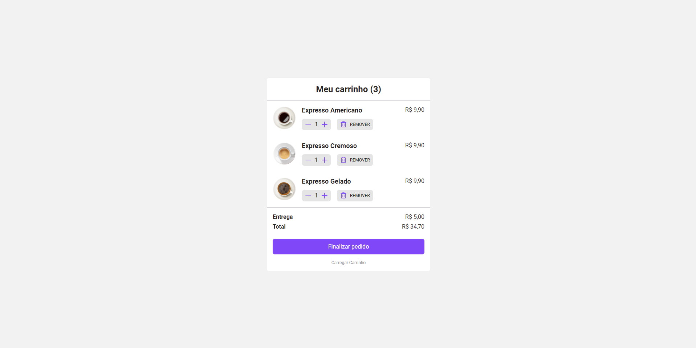
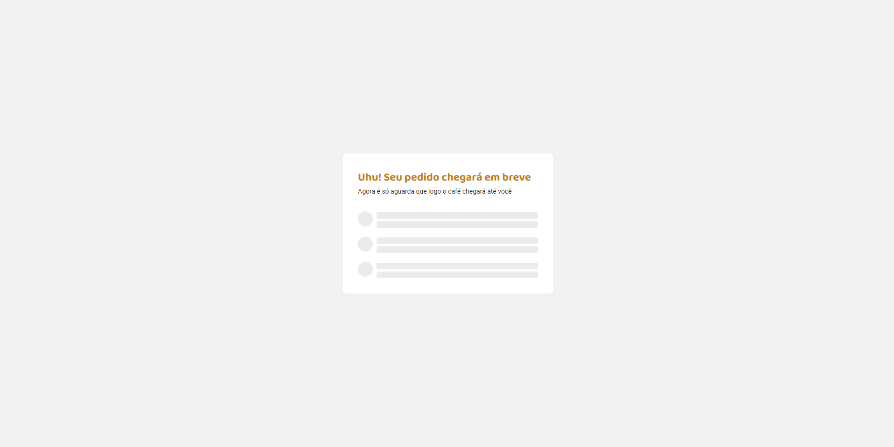
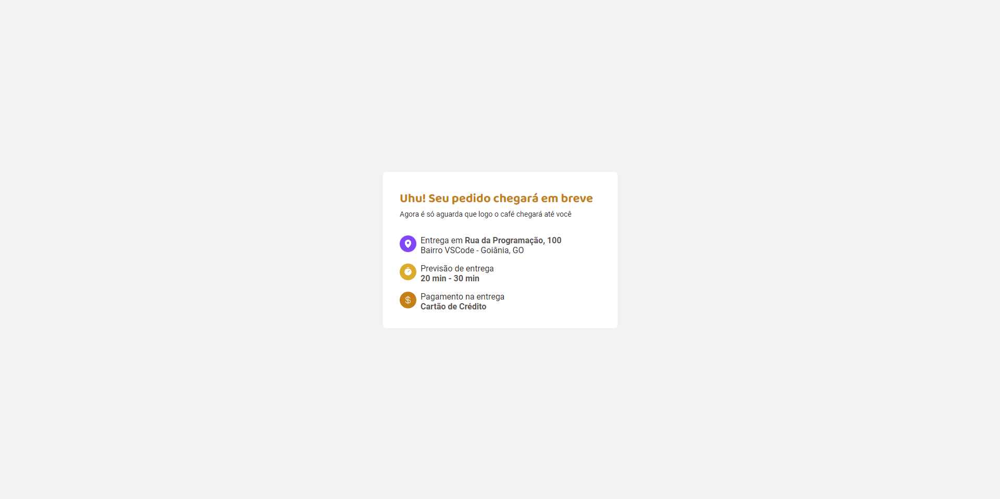

# Meu Carrinho 

Projeto em React + Typescript.

### Objetivo
Apresentar produtos no carrinho através do back-end "fake" em JSON-SERVER, oferecer frete grátis a partir de R$40,00 gastos e encaminhar página de sucesso do pedido!

### Imagens

#### Observação
O armazenamento dos produtos do carrinho está sendo feito através do JSON-SERVER com os dados disponíveis na pasta src/database/data.json

Poderiamos estar utilizando um meio mais eficiente para armazenamento, como localStorage, mas não foi essa opção escolhida pelos espectadores durante a live.

### Instação
- `npm i`

* Necessário possuir o JSON-SERVER, consulte https://www.npmjs.com/package/json-server para mais informações.

### Para rodar
- `npm run dev`
- `npm run server`
